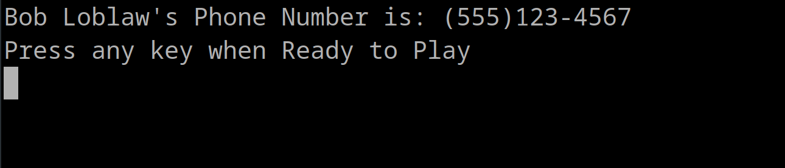
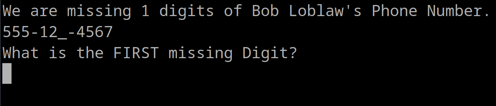
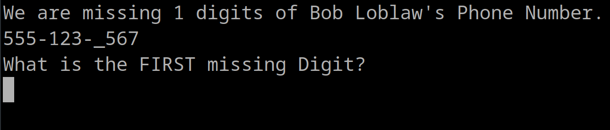
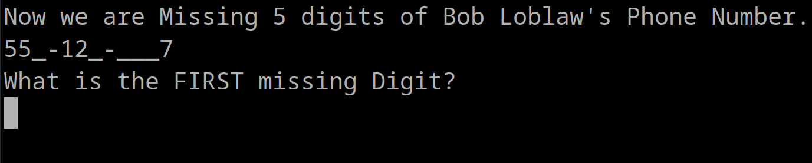
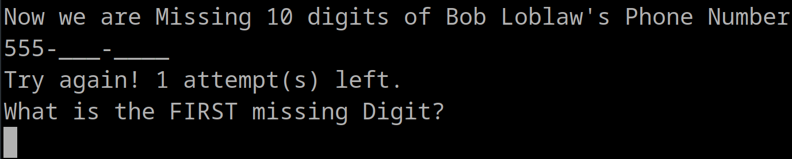
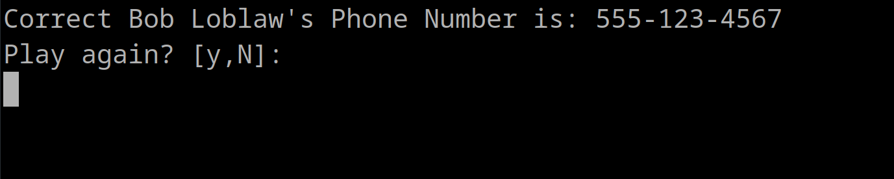
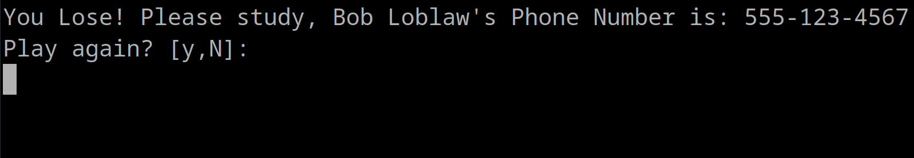

Quick terminal program I wrote to help my daughter remember a phone number.

Phone Numbers can be stored in a secrets.yml file(see example file)

It only accepts 10 digit phone numbers in any sane format(see example file)

## When the "game" starts it will show...
* a selection menu of numbers found in the secrets.yml  
  
* Once a selection is made it will ask if you want to show the number(defaults to yes) 
  
  
* then it will ask you to type the missing digits  
  
* The removal is randomized so every run is different
  
* on level 1 it will remove 1 digit, level 2 removes 2 digits... until all digits are blank
  
* The "game" will give you 4 tries to get it right the tries are for all 10 levels, worth noting that I had already entered '555' here. 
  
* When done it will ask if you want to play again(then it will bring up menu if yes)  
  
  